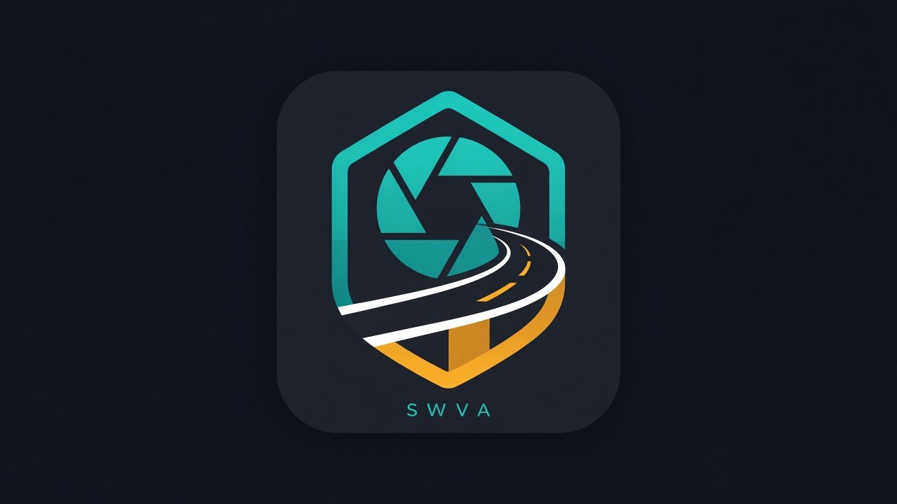

```
 ____ __        ___     _    _____           __  __ _        __        __    _       _
/ ___// /\    / / \   / \  |_   _|__ _ __  / / / /| |_ __ _/ /_______/ /   | |_ ___| |__
\___ \\/  \  / /\ \ / / \    | |/ _ \ '__|/ /_/ / | __/ _` \ \/ / __/ / /\ | __/ __| '_ \
 ___) / /\ \/ /  \ V / ___ \   | |  __/ |  / __  /  | || (_| |>  <\__ \ \/  / || (__| | | |
|____/_/  \__/    \_/ /   \_\  |_|\___|_| /_/ /_/    \__\__,_/_/\_\___/\__/ \__\___|_| |_|

        Southwest Virginia · VDOT / 511 traffic cameras
```

# SWVA Traffic Watch

<p align="center"></p>

**Free for everyone to use.** Optional donations help cover Ardean’s costs — this is not a paid product and not an official VDOT app.

Local viewer for **Southwest Virginia** traffic cameras from [511 Virginia / VDOT](https://511.vdot.virginia.gov): map with town + highway/MM labels, searchable list, **fullscreen** one-cam view, and a **2×2 four-camera** grid you can fill by typing a town (Marion, Chilhowie, Bristol, …).

No installers. No admin. No Python required on Windows. No npm / build step.

## Windows — download, run, and close (start here)

### 1. Download
1. Open the GitHub page in your browser.
2. Click the green **Code** button.
3. Click **Download ZIP**.
4. Save the ZIP somewhere easy, like your **Desktop** or **Downloads**.

### 2. Extract and keep the folder
1. Right-click the ZIP → **Extract All...** (or open it and drag the inner folder out).
2. Put the extracted folder somewhere permanent, for example your Desktop:
   - Desktop\swva-traffic-watch
3. Open that folder until you see **start.bat**.

### 3. Launch
1. Double-click **start.bat**.
2. A black **Command Prompt** window opens — **leave it open**.
3. Your browser should open http://127.0.0.1:8766 (if not, paste that address yourself).

You do **not** need Python on Windows. You do **not** need admin rights for a normal home PC.

### 4. Close properly
1. Close the browser tab (optional but tidy).
2. Click the **Command Prompt** window.
3. Press **Ctrl+C**, or click the **X** on that window.
4. That stops the local server. To use it again later, double-click **start.bat** again.

**Tips:** Keep the CMD window open while watching. Use http://127.0.0.1:8766 (not a `file://` page) so the camera-list proxy works. Hard-refresh (Ctrl+F5) after updates.

## What you can do

| Action | How |
|--------|-----|
| **Map** | Pins show nearest town + highway / MM (with spaced labels + callout lines when crowded) |
| **Search / filter** | Town, route, and text search; sort by town, near Marion, or route |
| **One camera fullscreen** | Open a cam → Fullscreen (or **F**); Esc exits |
| **4 cameras** | **By town** / **Town search** → type Marion, Chilhowie, Bristol… → **Fill 4 cameras near …** |
| **Presets** | Near Marion / I-81 / I-77 chips when available from the live feed |

## Data sources

| Layer | Source |
|-------|--------|
| **Cameras** | [511 Virginia](https://511.vdot.virginia.gov) map cams GeoJSON (`/services/map/layers/map/cams`) via local `/proxy/cams` |
| **Video** | VDOT HLS streams (`*.vdotcameras.com`) with snapshot fallback |
| **Basemap** | Esri Canvas Dark Gray |

Be polite to public feeds. This app is **not** affiliated with VDOT. Always prefer [511.vdot.virginia.gov](https://511.vdot.virginia.gov) for official traveler information.

## Cost / API keys

**No publisher API keys.** You run it on your PC and hit public VDOT / 511 feeds from **your** IP. Running a copy does not create usage charges for the author.

## Trust & security

- Runs **locally** on `http://127.0.0.1:8766`
- Default server binds localhost; do not expose the port to the internet unless you understand the risk
- See [SECURITY.md](SECURITY.md) for the policy and private vulnerability reporting
- Prefer this GitHub repo (or Releases) as the download source

## Optional support

Tips are **100% optional**.

| Method | Handle |
|--------|--------|
| Cash App | [$AnthonyDean16](https://cash.app/$AnthonyDean16) |

## License

App code: [MIT](LICENSE). Camera feeds and trademarks belong to their owners (VDOT / 511 Virginia and others).

## Privacy

Runs in your browser / on your LAN. No account required for the viewer itself.

## Credits

Built by **Tony Dean** (Ardean), Marion / Smyth County, Virginia.

Assisted by **Grok Bot** — [https://x.ai/bot](https://x.ai/bot) · download: [https://cursor.com/download/bot](https://cursor.com/download/bot)
